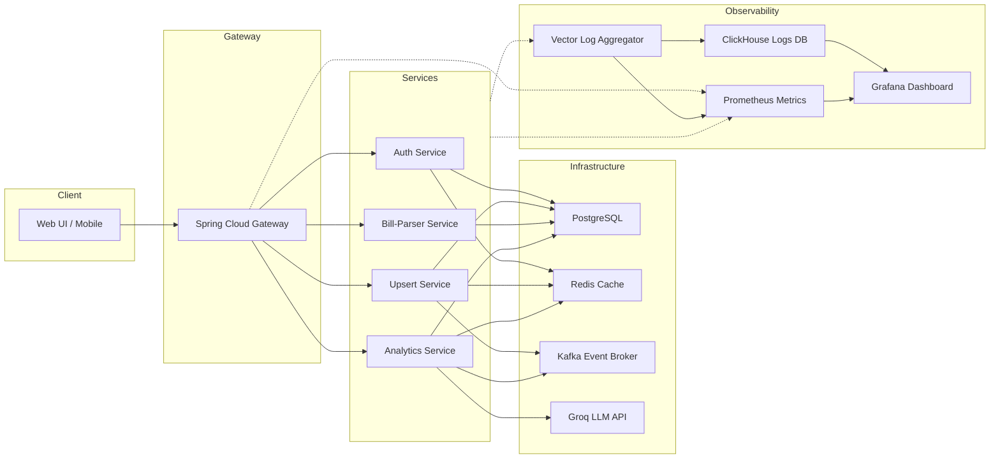

# Personal Finance Assistant

[](https://openjdk.org/)
[](https://developer.mozilla.org/en-US/docs/Web/JavaScript)
[](https://developer.mozilla.org/en-US/docs/Web/HTML)
[](https://spring.io/projects/spring-boot)
[](https://www.docker.com/)
[](https://www.postgresql.org/)
[](https://redis.io/)
[](https://kafka.apache.org/)
[](https://zookeeper.apache.org/)
[](https://clickhouse.com/)
[](https://vector.dev/)
[](https://grafana.com/)

A comprehensive, production-ready personal finance platform built on a microservices architecture. This application enables users to track income and expenses, manage split bills, define savings goals, automatically extract structured data from scanned receipts, and receive AI-generated financial insights. 

All services communicate securely via a JWT-secured API Gateway, utilizing Redis for high-performance caching and Kafka for asynchronous event propagation. The system is also equipped with an enterprise-grade observability pipeline powered by Vector, ClickHouse, and Grafana for centralized logging and telemetry.

---
## Architecture Overview



---
## Key Features

- **Income & Expense Tracking**: Fully-featured ledger to record, categorize, and query day-to-day financial transactions.
- **Automated Subscription Detection**: A scheduled background job analyzes historical spending patterns to automatically detect recurring payments (e.g., Netflix, Gym), tracking active subscriptions and projecting upcoming charge dates.
- **Savings Goals**: Users can define target amounts and deadlines for specific goals (e.g., "Vacation Fund"). The platform tracks progress and calculates required monthly contributions.
- **Category Budgets**: Set hard spending limits across different categories (e.g., "Food", "Entertainment"). Real-time analytics track your burn rate to prevent overspending.
- **Group Split Bills**: Seamlessly share expenses among friends or roommates. The system automatically calculates complex debt relationships to determine exactly who owes whom.
- **AI-Powered Financial Insights**: Aggregates your transaction history and feeds it securely into the Groq LLM API to generate personalized financial health scores and actionable insights.
- **OCR Receipt Parsing**: Upload an image of a receipt, and the backend uses PaddleOCR to instantly extract the merchant, total amount, and date for one-click ingestion.

---
## System Architecture & Data Flow

This platform is engineered as a highly scalable, event-driven microservices ecosystem. Below is a detailed breakdown of how data flows through the system and how each component interacts.

### 1. Client Application (Frontend)
The user interface is engineered as a lightning-fast Single Page Application (SPA).
- **Zero-Dependency Core**: Built purely with Vanilla JavaScript (ES6 Modules) and native HTML5/CSS3 to guarantee near-instant load times and minimal memory footprint without the overhead of heavy frameworks like React or Angular.
- **Dynamic Data Visualization**: Leverages **Chart.js** to render real-time, interactive pie charts and trend lines for user analytics and budgets.

### 2. API Gateway & Security Layer
All incoming client traffic (Web UI or Mobile) is routed through the **Spring Cloud Gateway**. 
- **Centralized Routing & CORS**: The Gateway handles CORS configuration and dynamically routes requests to the appropriate downstream microservice (`/auth/**` to Auth Service, `/upsert/**` to Upsert Service, etc.).
- **Security Validation**: Every protected route requires a valid JSON Web Token (JWT). The Gateway intercepts requests, cryptographically validates the JWT signature (without needing to ping the Auth service), and securely forwards the extracted `X-User-Id` downstream via HTTP headers. 

### 3. Core Business Services (Synchronous Flow)
Once a request passes the Gateway, it hits one of the domain-driven services:
- **Auth Service**: Manages user registration and authentication. It verifies credentials against hashed passwords stored in PostgreSQL, generates short-lived access tokens, and utilizes Redis to track active sessions or blacklist compromised tokens.
- **Upsert Service**: The primary operational engine. It executes all core mutations (CRUD operations) for transactions, budgets, savings goals, and shared group bills. It guarantees ACID compliance by persisting canonical state directly to its isolated schema in **PostgreSQL**.
- **Bill-Parser Service**: A specialized microservice designed to handle file uploads. It utilizes **PaddleOCR** to perform Optical Character Recognition on receipt images. It synchronously extracts semantic data (Merchant Name, Total Amount, Date) and returns a structured JSON payload to the client for easy transaction ingestion.

### 4. Event-Driven Architecture (Asynchronous Flow)
To ensure high performance and loose coupling, the system leverages **Apache Kafka** and **Redis** for state propagation.
- **The Outbox Pattern**: When the Upsert Service successfully modifies data (e.g., adding a new transaction), it atomically saves the transaction to the database *and* publishes a `transaction-cache-evict` event to Kafka. 
- **Real-Time Analytics**: The **Analytics Service** acts as a Kafka consumer. It listens to these cache eviction events. When a user's financial data changes, the Analytics Service instantly invalidates their stale, pre-computed aggregations residing in the Redis Cache.
- **AI-Powered Insights**: When a user requests their financial health dashboard, the Analytics Service aggregates their spending history and queries the external **Groq LLM API**. This generates personalized, AI-driven financial insights (e.g., warning the user about subscription bloat), which are then cached in Redis for extremely fast subsequent retrievals.

### 5. Telemetry & Observability Pipeline
A robust, enterprise-grade observability stack monitors the entire cluster.
- **Log Aggregation (Vector & ClickHouse)**: Every microservice outputs structured JSON logs. **Vector** acts as an ultra-fast, lightweight log aggregator that scrapes the Docker socket, sanitizes the payloads (redacting PII like emails and passwords), and ships the logs in bulk to **ClickHouse**—a columnar database optimized for massive analytical queries.
- **Metrics Scraping (Prometheus)**: Each Spring Boot microservice exposes a `/actuator/prometheus` endpoint. **Prometheus** periodically scrapes these endpoints to collect JVM metrics, HTTP latencies, and connection pool statuses. Additionally, Vector computes real-time error rates from the log streams and exposes them as native Prometheus metrics.
- **Visualization (Grafana)**: **Grafana** serves as the single pane of glass. It is pre-configured with ClickHouse and Prometheus data sources, offering rich dashboards that visualize system health, error traces, and infrastructure bottlenecks.

---
## Quick Start

### Prerequisites
- Docker and Docker Compose (v24 or newer)
- Java 21 (optional, required only for local compilation)
- Maven 3.9+ (optional, required only for local compilation)

### 1. Clone the Repository
```bash
git clone https://github.com/verginjose/Personal-Finance-Assistant.git
cd Personal-Finance-Assistant
```

### 2. Start the Infrastructure Stack
```bash
docker compose up -d
```
This command initializes PostgreSQL, Redis, Kafka, the complete suite of microservices, and the observability stack.

Services expose the following ports locally (refer to `docker-compose.yml` for details):
- API Gateway: `8080`
- Auth Service: `8082`
- Upsert Service: `8081`
- Bill-Parser Service: `8083`
- Analytics Service: `8084`
- Grafana: `3000`
- Prometheus: `9090`
- ClickHouse: `8123`

### 3. Verify System Health
```bash
curl http://localhost:8080/health        # API Gateway health check
curl http://localhost:8082/auth/health   # Auth Service health check
```

### 4. Execute the End-to-End Test Suite
```bash
python3 requests/run_e2e_tests.py
```
The testing script will perform a full system validation. Expected outcome: `71 passed, 0 failed`.

---
## API Documentation
The comprehensive list of HTTP endpoints, including request and response schemas, is available in the companion documentation files:
- Markdown format: [`endpoints.md`](endpoints.md)
- OpenAPI specification: [`openapi.yaml`](openapi.yaml)

---
## Testing Methodology
This repository ships with a comprehensive Python-based End-to-End (E2E) test suite that exercises the entire system architecture. Coverage includes:
- Authentication, token generation, and secure session handling.
- Full CRUD operations for transactions, goals, budgets, and split-bill groups.
- End-to-end OCR bill ingestion using sample images.
- AI-driven insight generation and cache eviction workflows via Kafka.
- Analytics generation and complex health-score calculations.

The suite can be executed locally using the commands outlined above. Continuous Integration pipelines are configured to execute this script on every push to ensure system integrity. Furthermore, each microservice contains a comprehensive suite of Unit and Integration tests leveraging JUnit and Spring Boot Test. These can be executed by running `mvn test` in each respective service directory.