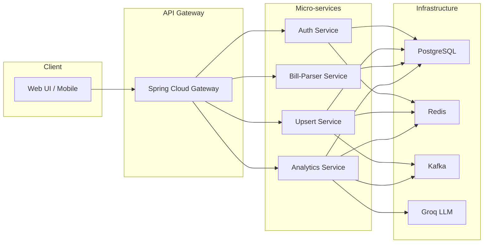

# 💰 Personal Finance Assistant

[](https://openjdk.org/)
[](https://spring.io/projects/spring-boot)
[](https://www.docker.com/)
[](https://www.postgresql.org/)
[](https://grafana.com/)

A **complete, production‑ready personal finance platform** built on a **micro‑services** architecture. It lets users track income/expenses, split bills, manage savings goals & budgets, automatically extract data from scanned bills, and receive AI‑generated financial insights. All services communicate via **JWT‑secured API gateway**, **Redis caching**, and **Kafka‑driven event propagation**.

---
## 🏗️ Architecture Overview



> The diagram above is generated with Mermaid and rendered by GitHub/Markdown viewers.

---
## 🚀 Quick Start

### Prerequisites
- **Docker & Docker‑Compose** (≥ 24)
- **Java 21** (for local builds) – optional if you only run the containers.
- **Maven 3.9+** (for local compilation of individual services).

### 1. Clone the repo
```bash
git clone https://github.com/verginjose/Personal-Finance-Assistant.git
cd Personal-Finance-Assistant
```

### 2. Start the stack
```bash
docker compose up -d   # starts Postgres, Redis, Kafka, all services & observability stack
```
> Services expose the following ports (see `docker-compose.yml`):
> - API Gateway 8080
> - Auth 8082, Upsert 8081, Bill 8083, Analytics 8084
> - Grafana 3000, Prometheus 9090, ClickHouse 8123

### 3. Verify health
```bash
curl http://localhost:8080/health   # API gateway health
curl http://localhost:8082/auth/health   # Auth service health
```

### 4. Run the end‑to‑end test suite
```bash
python3 requests/run_e2e_tests.py
```
All tests should pass (`71 passed, 0 failed`).

---
## 📚 API Overview
The full list of HTTP endpoints (including request/response schemas) is available in the companion documentation:
- **Markdown version:** [`endpoints.md`](endpoints.md)
- **OpenAPI spec:** [`openapi.yaml`](openapi.yaml)

---
## 🧪 Testing
The repository ships a **Python‑based E2E test suite** that exercises the complete flow:
- authentication & token handling
- CRUD operations for transactions, goals, budgets, and split‑bill groups
- OCR bill ingestion (sample image included)
- AI‑insights generation & cache eviction via Kafka
- analytics charts and health‑score calculations

Run it locally with the command shown above; CI pipelines execute the same script on every push.

---
## 🤝 Contributing
1. Fork the repository.
2. Create a feature branch (`git checkout -b feat/my‑feature`).
3. Follow the project's **code‑style** (Spotless + Checkstyle Maven plugins).
4. Run the full test suite (`./mvnw verify && python3 requests/run_e2e_tests.py`).
5. Submit a Pull Request.

---
## 📜 License & Acknowledgements
Licensed under the **MIT License**. Thanks to the maintainers of Spring Boot, Docker, PostgreSQL, Grafana, Prometheus, ClickHouse, PaddleOCR, and the Groq LLM API.

---
*Happy budgeting!*
