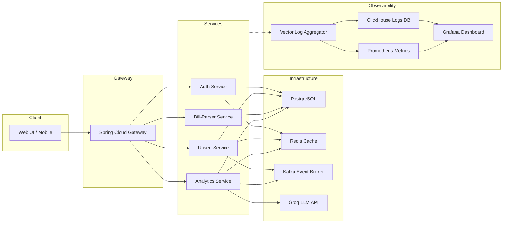

# Personal Finance Assistant

[](https://openjdk.org/)
[](https://spring.io/projects/spring-boot)
[](https://www.docker.com/)
[](https://www.postgresql.org/)
[](https://grafana.com/)

A comprehensive, production-ready personal finance platform built on a microservices architecture. This application enables users to track income and expenses, manage split bills, define savings goals, automatically extract structured data from scanned receipts, and receive AI-generated financial insights. 

All services communicate securely via a JWT-secured API Gateway, utilizing Redis for high-performance caching and Kafka for asynchronous event propagation. The system is also equipped with an enterprise-grade observability pipeline powered by Vector, ClickHouse, and Grafana for centralized logging and telemetry.

---
## Architecture Overview



> The diagram above is generated with Mermaid and rendered natively by GitHub.

---
## Quick Start

### Prerequisites
- Docker and Docker Compose (v24 or newer)
- Java 21 (optional, required only for local compilation)
- Maven 3.9+ (optional, required only for local compilation)

### 1. Clone the Repository
```bash
git clone https://github.com/verginjose/Personal-Finance-Assistant.git
cd Personal-Finance-Assistant
```

### 2. Start the Infrastructure Stack
```bash
docker compose up -d
```
This command initializes PostgreSQL, Redis, Kafka, the complete suite of microservices, and the observability stack.

Services expose the following ports locally (refer to `docker-compose.yml` for details):
- API Gateway: `8080`
- Auth Service: `8082`
- Upsert Service: `8081`
- Bill-Parser Service: `8083`
- Analytics Service: `8084`
- Grafana: `3000`
- Prometheus: `9090`
- ClickHouse: `8123`

### 3. Verify System Health
```bash
curl http://localhost:8080/health        # API Gateway health check
curl http://localhost:8082/auth/health   # Auth Service health check
```

### 4. Execute the End-to-End Test Suite
```bash
python3 requests/run_e2e_tests.py
```
The testing script will perform a full system validation. Expected outcome: `71 passed, 0 failed`.

---
## API Documentation
The comprehensive list of HTTP endpoints, including request and response schemas, is available in the companion documentation files:
- Markdown format: [`endpoints.md`](endpoints.md)
- OpenAPI specification: [`openapi.yaml`](openapi.yaml)

---
## Testing Methodology
This repository ships with a comprehensive Python-based End-to-End (E2E) test suite that exercises the entire system architecture. Coverage includes:
- Authentication, token generation, and secure session handling.
- Full CRUD operations for transactions, goals, budgets, and split-bill groups.
- End-to-end OCR bill ingestion using sample images.
- AI-driven insight generation and cache eviction workflows via Kafka.
- Analytics generation and complex health-score calculations.

The suite can be executed locally using the commands outlined above. Continuous Integration pipelines are configured to execute this script on every push to ensure system integrity. Furthermore, each microservice contains a comprehensive suite of Unit and Integration tests leveraging JUnit and Spring Boot Test. These can be executed by running `mvn test` in each respective service directory.

---
## Contributing Guidelines
1. Fork the repository.
2. Create an isolated feature branch (`git checkout -b feature/your-feature-name`).
3. Adhere to the established code style guidelines (enforced via Spotless and Checkstyle Maven plugins).
4. Run the full test suite (`./mvnw verify && python3 requests/run_e2e_tests.py`) before committing.
5. Submit a detailed Pull Request.

---
## License and Acknowledgements
This project is licensed under the MIT License. 
Special thanks to the open-source maintainers of Spring Boot, Docker, PostgreSQL, Grafana, Prometheus, ClickHouse, PaddleOCR, and the Groq LLM API.
